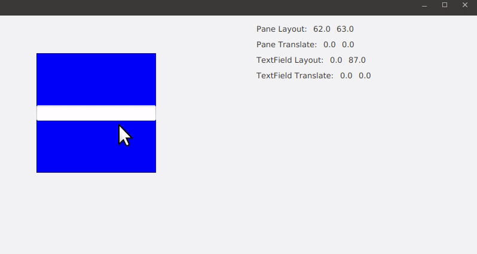

Experience difference between `layoutX` and `translateX`:

 - layout coordinate: coordinate defined by parent layout (relative to parent layout)
 - translate coordinate: offset to layout coordinate
 